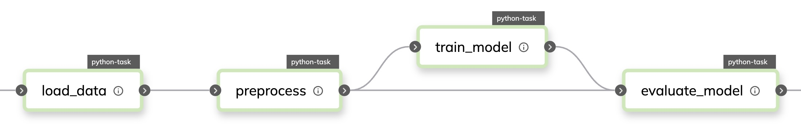

title: Dive into Flytekit's Internals: A Python SDK to Quickly Bring your Code Into Production
use_katex: False
class: title-slide

# Dive into Flytekit's Internals: A Python SDK to Quickly Bring your Code Into Production

.larger[Thomas J. Fan]<br>
<a href="https://www.github.com/thomasjpfan" target="_blank" class="title-link"><span class="icon icon-github right-margin"></span>@thomasjpfan</a>
<a class="this-talk-link", href="https://github.com/thomasjpfan/scipy-2025-flytekit" target="_blank">github.com/thomasjpfan/scipy-2025-flytekit</a>

---

# Introduction


- OSS: Scikit-learn maintainer
- At Modal now
- Previously, worked on the `flytekit` Python SDK

---

# Contents

.g[
.g-6[
1. Why Flyte?
2. From Python to Remote Cluster
3. Unraveling a Flyte Task
]
.g-6[

]
]

---

# Why Flyte?

.g[
.g-6[
- Reliable 🪢
]
.g-6[

]
]

---

# Why Flyte?

.g[
.g-6[
- Reliable 🪢
- Scalable 🗻
]
.g-6[

]
]

---

# Why Flyte?

.g[
.g-6[
- Reliable 🪢
- Scalable 🗻
- Velocity 🏎️
]
.g-6[

]
]

---

# High level overview of Flyte

- Diagram of Python code -> DAG -> Kubernetes
- Audience poll about Containers then Kubernetes

---

# Python Code to Static Workflow

```python
from flytekit import task, workflow

@task
def load_data() -> pd.DataFrame:
	...

@task
def preprocess(data: pd.DataFrame) -> tuple[pd.DataFrame, pd.DataFrame]:
	...

@workflow
def main() -> float:
    data = load_data()
    train, test = preprocess(data=data)
    model = train_model(train=train)
    return evaluate_model(model=model, data=test)
```

--

```bash
pyflyte run --remote main.py wf
```

--

- Collection of tasks
- Describes data flow



---

# Most Popular Feature

```python
from flytekit import map_task

@workflow
def main():
	datasets = query_many_datasets()

```

---

# Workflow: Serialized with protobuf

- Workflow can now be managed by Golang

---

# Workflow to Kubernetes

```python
@task
def preprocess(data: pd.DataFrame) -> tuple[pd.DataFrame, pd.DataFrame]:
	...
```

## Pod Specification

```yaml
Name: azthpf845mgkp7f6hkpw-n1-0
Namespace: flytesnacks-development
Containers:
  azthpf845mgkp7f6hkpw-n1-0:
    Args:
	  pyflyte-fast-execute
	  --additional-distribution s3://my-s3-bucket/...
```

---

# Review high level
- Diagram of Python code -> DAG -> Kubernetes

---

class: title-slide

# Deep Dive into Tasks

---

# Resources

```python
from flytekit import Resources

@task(
*    requests=Resources(cpu=2, mem="2Gi")
*    limits=Resources(cpu=4, mem="8Gi"),
)
def train_model(train: pd.DataFrame) -> BaseEstimator:
	...
```

```yaml
Requests:
  cpu: 1
  memory: 1Gi
Limits:
  cpu: 2
  memory: 4Gi
```

---

# Resources: GPU

```python
from flytekit.extras.accelerators import A100

@task(
	accelerator=A100
)
def train_model(...):
	...
```


```yaml
tolerations:
  - operator: Equal
    value: nvidia-tesla-a100
	effect: NoSchedule
```

---

# Python Dependencies

## Prebuilt image

```python
@task(
	container_image="..."
)
def train_model(...):
```

--

```python
from flytekit import ImageSpec

image = ImageSpec(
	packages=["numpy", "scikit-learn"]
)
```

```python
@task(container_image=image)
def train_model(...):
```

---

# Local Code to Remote

```python
from utils import split_data

@task
def preprocess(data: pd.DataFrame) ->  tuple[pd.DataFrame, pd.DataFrame]:
	train, test = split_data(data)
```

```bash
utils.py
wf.py
```

---

# Non-Python files

```bash
bin/custom_executable
wf.py
```

```bash
pyflyte run --remote --copy all wf.py main
```

---

# How does container know about the code?

## Entrypoint:

```yaml
Args:
  pyflyte-fast-execute
  --additional-distribution
* s3://my-s3-bucket/flytesnacks/development/...
  --dest-dir .
```

## Which module to load?

```yaml
  pyflyte-execute ...
  --resolver flytekit.core.python_auto_container.default_task_resolver
  --
  task-module wf
  task-name preprocess
```

---

# Strict Typing

## Literal Types

```python
@task
def say_hello(name: str) -> str:
    return f"Hello, {name}!"

@workflow
def hello_world_wf(name: str = "world") -> str:
    greeting = say_hello(name=name)
    return greeting
```

## Converted directly to "Flyte Literal" types

- `str`, `int`, `bool`, `float`

## Stored in object store (S3)

---

# Dataclass-like types

```python
from dataclasses import dataclass
from flytekit import task

@dataclass
class MyData:
    name: str
    value: int

@task
def create_data() -> MyData:
    return MyData(name="abc", value=123)
```

## Serialized with as `MessagePack`
## Stored in object store (S3)

---

# Offloaded types

## `FlyteFile` & `FlyteDirectory`

## Offloaded to Object store (S3)

```python
from flytekit import FlyteFile

@task
def create_file() -> FlyteFile:
    file = FlyteFile.new_remote_file()

    with file.open("w") as f:
        f.write("my content")
    return file
```

## Downloaded when requested

```python
@task
def read_file(file: FlyteFile) -> str:
    with file.open("r") as f:
        return f.read()
```

---

# Types in `flytekit`

```python
@task
def make_dataset() -> np.ndarray:
	return np.asarray([[1, 2, 3], [4, 5, 6]])
```

```python
class NumpyArrayTransformer(AsyncTypeTransformer[np.ndarray]):
    async def async_to_literal(self, ...);
		# Serialize data
	    np.save(...)

	async def async_to_python_value(self, ...):
		# Deserialize data
		return np.load(...)
```

```python
from flytekit.core.type_engine import TypeEngine

TypeEngine.register(NumpyArrayTransformer())
```

[flytekit/types/numpy/ndarray.py](https://github.com/flyteorg/flytekit/blob/master/flytekit/types/numpy/ndarray.py)

---

# Extending with Custom Type

```python
import polars as pl

@task
def preprocess(df: pl.DataFrame) -> pl.DataFrame:
	...
```

```bash
pip install flytekitplugins-polars
```

## Serialized into parquet files

---

# How does Plugins get load?

```python
setup(
    entry_points={"flytekit.plugins": [f"polars=flytekitplugins.polars"]},
)
```

```python
StructuredDatasetTransformerEngine.register(PolarsDataFrameToParquetEncodingHandler())
StructuredDatasetTransformerEngine.register(ParquetToPolarsDataFrameDecodingHandler())
```

[plugins/flytekit-polars/flytekitplugins/polars/sd_transformers.py](https://github.com/flyteorg/flytekit/blob/master/plugins/flytekit-polars/flytekitplugins/polars/sd_transformers.py)

---

# How is data passed between tasks?

- Show diagram of workflow

--

## Through the entrypoint with a Template:

```yaml
Args:
  pyflyte-fast-execute
  -additional-distribution s3://...
  --
  pyflyte-execute
  --inputs {{.inputs}}
  --output-prefix {{.outputPrefix}}
  --raw-output-data-prefix {{.rawOutputDataPrefix}}
```

---

# Entrypoint is Populated by Flyte:

## `inputs.pb` & `outputs.pb`

```yaml
Args:
  pyflyte-fast-execute
  -additional-distribution s3://...
  --
  pyflyte-execute
  --inputs s3://my-s3-bucket/metadata/.../data/inputs.pb
  --output-prefix s3://my-s3-bucket/metadata/.../data/0
```

- Inputs: `s3://my-s3-bucket/metadata/.../data/inputs.pb`
- Outputs: `s3://my-s3-bucket/metadata/.../data/0/outputs.pb`

---

# What about errors?

- Errors:`s3://my-s3-bucket/metadata/.../data/0/errors.pb`
- Screenshot of error

---

# Flyte Deck

```python
@task(enable_deck=True)
def query_environment():
	...
```

- Static HTML: `s3://my-s3-bucket/metadata/.../data/0/deck.html`

---

# Retries for "free"

```python
@task(retries=5)
def preprocess():
	...
```

## Show workflow DAG again

---

# Language agnostic

## `inputs.pb`, `outputs.pb` & `errors.pb`

--

```python
t2 = ShellTask(
    name="task_2",
    script="""
    set -ex
    cp {inputs.x} {inputs.y}
    tar -zcvf {outputs.j} {inputs.y}
    """,
    inputs=kwtypes(x=FlyteFile, y=FlyteDirectory),
    output_locs=[OutputLocation(var="j", var_type=FlyteFile, location="{inputs.y}.tar.gz")],
)
```

---

# Runtime variables

```python
from flytekit import current_context

@task
def query_environment():
	ctx = current_context()

    print(ctx.execution_id.name)
    print(ctx.execution_id.domain)
    print(ctx.execution_id.project)
```

--

## Kubernetes Pod Specification

```yaml
Environment:
  FLYTE_INTERNAL_EXECUTION_ID: a45gqlrs7c87dqkksbrl
  FLYTE_INTERNAL_EXECUTION_PROJECT: flytesnacks
  FLYTE_INTERNAL_EXECUTION_DOMAIN: development
```

---

# PodTemplates: Full Kubernetes Control

```python
from flytekit import PodTemplate
from kubernetes.client import V1PodSpec, V1Container, V1Volume, V1Toleration

pod_template = PodTemplate(
	primary_container_name="primary",
	labels={"key1": "value1", "key2": "value2"},
	annotations={"key3": "value3"},
	pod_spec=V1PodSpec(...),
	volumes=[V1Volume(name="volume")],
	tolerations=[
		V1Toleration(...)
	]
)

@task(container_image=pod_template)
def my_task():
	...
```

---

# Ray, Dask, Spark

## Running on your Cluster!

- Ray: [kuberay](https://github.com/ray-project/kuberay)
- Dask: [dask-kubernetes](https://github.com/dask/dask-kubernetes)
- Spark: [spark-operator](https://github.com/kubeflow/spark-operator)

---

# Dask

Extension using `task_config`

```python
from flytekit import Resources, task
from flytekitplugins.dask import Dask, Scheduler, WorkerGroup

@task(
  task_config=Dask(
      scheduler=Scheduler(
          limits=Resources(cpu="1", mem="2Gi"),
      ),
      workers=WorkerGroup(
          limits=Resources(cpu="4", mem="10Gi"),
      ),
  ),
)
def dask_preprocessing():
	...
```

---

# How does `task_config=Dask` work?

```bash
pip install flytekitplugins-dask
```

## Loaded when `flytekitplugins.dask.Dask` is imported

```python
TaskPlugins.register_pythontask_plugin(Dask, DaskTask)
```

[plugins/flytekit-dask/flytekitplugins/dask/task.py](https://github.com/flyteorg/flytekit/blob/master/plugins/flytekit-dask/flytekitplugins/dask/task.py)

---

# Spark

```python
from flytekitplugins.spark import Spark

@task(
    task_config=Spark(
        spark_conf={
            "spark.driver.memory": "1000M",
            "spark.executor.memory": "1000M",
            "spark.executor.cores": "1",
            "spark.executor.instances": "2",
            "spark.driver.cores": "1",
            "spark.jars": "https://storage.googleapis.com/hadoop-lib/gcs/gcs-connector-hadoop3-latest.jar",
        }
    ),
)
def hello_spark(partitions: int) -> float:
```

---

# Ray

```python
from flytekitplugins.ray import HeadNodeConfig, RayJobConfig, WorkerNodeConfig

ray_config = RayJobConfig(
    head_node_config=HeadNodeConfig(ray_start_params={"log-color": "True"}),
    worker_node_config=[WorkerNodeConfig(group_name="ray-group", replicas=1)],
    runtime_env={"pip": ["numpy", "pandas"]},
)

@task(
    task_config=ray_config,
    requests=Resources(mem="2Gi", cpu="2"),
    container_image=custom_image,
)
def ray_task(n: int) -> typing.List[int]:
```

---

# Flyte Overview

- Python -> DAG -> Kubernetes
- Review everything

# Why Flyte
- Conclusion - Why Flyte?
	- Python -> DAG -> Kubernetes
	- Reliable
	- Scalable
	- Velocity

# Backend architecture
- https://www.union.ai/docs/flyte/architecture/component-architecture/flytepropeller_architecture/

# Conclusion
- Slack
- Slides
- Me

---

class: middle, center

# Before we start :)

.g[
.g-6[.success.bold.center[
    If you are from NYC, **Push 1**.
]]

.g-6[.alert.bold.center[
    Otherwise, **Push 2**.
]]
]

---

class: middle

> Creativity is just connecting things. When you ask creative people how they did something,
> they feel a little guilty because they didn't really do it, they just saw something.
> It seemed obvious to them after a while. That's because they were able to connect
> experiences they've had and synthesize new things.
>
> <cite>Steve Jobs</cite>

---

# This is an image


---

# This is a equation

$$
F=ma
$$

---

# This is some code

.g[
.g-6[
```python
# This is a comment
def hello(a, b):
    return a + b
```
]
.g-6[

```ruby
def add(a, b)
  a + b
end
```
]
]

---

# This is huge

.g.g-around[
.g-8.success.bold.center[
    This is wowowowow
]]

## Here is some numpy

```py
>>> df['int_1'].values
array([     0,      1,      2, ..., 999997, 999998, 999999])
```


---

# Here is some code

.g[
.g-4[
This is a [link](https://thomasjpfan.com) about something interesting here
]
.g-8[
```python
import numpy as np

X = np.linspace(0, 10)
```
]
]


---

# Here is a table

| train has infreq | error  | ignore            | infreq_ignore       |   |
|------------------|--------|-------------------|---------------------|---|
| True             | errors | all zeros (werid) | place in infreq bin |   |
| False            | errors | all zeros         | all zeros           |   |

---

class: title-slide

# Thank you!

.larger[Thomas J. Fan]<br>
@thomasjpfan<br>
<a href="https://www.github.com/thomasjpfan" target="_blank"><span class="icon icon-github icon-left"></span></a>
<a href="https://www.twitter.com/thomasjpfan" target="_blank"><span class="icon icon-twitter"></span></a>
<a class="this-talk-link", href="https://github.com/thomasjpfan/slides-template" target="_blank">
This talk on Github: thomasjpfan/slides-template</a>
